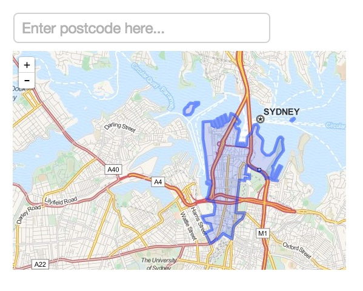

# Australia Postcode Viewer

## Overview

We want to have a simple web page where we can enter either a suburb name (e.g. Perth) or a
numeric postcode (e.g. 6000) in a text box and then have the boundary of that
postcode appear on a Google map on the page.

The input box for the postcode should auto-complete, so if I type 'Pe' then
Perth will be one of the items shown in a list of possible completions.

There should be an admin page with a username, password login on which I can
manually edit the underlying data.

The postcode data can be found in the data directory in this repository.

## Mockup

The resulting page should look something like this. You can follow this as a
rough guide and make changes as you see fit as long as it is possible to type in
a suburb or postcode and see the outline on the map.

## Technology Stack

Please use:
* Rails 4
* Active Admin
* Google Maps API v3
* Twitter Bootstrap
* Postgres
* Rspec
* RVM or rbenv
* Bundler

## Notes

* You may need a development version of Active Admin with Rails 4
* Add Rspec tests to any API methods you create for the JavaScript to talk to
  the Rails backend
* Use any JavaScript package you want to
* Use CoffeeScript if you prefer this to JavaScript
* The supplied datasets may be incomplete, don't worry about that too much as
  long as the basic functionality is in place
* Add some tests to your JavaScript as you think appropriate

## Deliverables

You should clone this repository and then make a Pull Request with your changes.
We want to be able to see via the git history how you went about making the
website. Don't worry, we are not looking for a perfectly polished history but
just want to see the steps taken.

We should be able to checkout your branch, run the rails server locally and see
the resulting page. You should supply us with username and password for a
default admin user. There should be a page at /admin where we can view, edit and
search for postcode entries using Active Admin.

Ensure there is a good README (replace this one if you want) that tells us how
to get everything that you have built running.

## Stretch Goals

These are some suggestions on what could be stretch goals if you finish the
initial task well ahead of schedule. We would not be expecting you to undertake
all of these, but rather select one or more that appeal to you.

* Use React.js for the front-end components.
* Allow the user to click anywhere in Australia and have the website tell them which
  postcode they clicked in.
* Find and import some other geospatial data source i.e. population density and
  display the population density for the postcode the user searches for.
* Use Grunt or Gulp and browserify or webpack to allow the use of CommonJS
  modules in your project - perhaps export your own JavaScript as a module.
* A toggle on the page to 'show all' boundaries. Make this stream as required to
  be performant.
* A dropdown to optionally allow the postcode search to be limited to a single
  state
* Allow an admin to edit the boundary of a suburb from the admin page (by
  dragging the points on the boundary on a map)
* Turn it into a game, where the user is given a suburb and using an unmarked
  map they must click to guess where the suburb is. If they click a point in the
  suburbs boundary they get a point, otherwise they are told how far away they
  were to the centre of the suburb.
* Allow users to view multiple suburbs at once. When a suburb is selected it is
  toggled. So if you search for and select a second suburb the first remains on
  the map, and if you re-select the same suburb it is removed. When the user
  comes back to the page, after navigating elsewhere they are shown the
  suburb(s) and map location they were last viewing.
* Keep track of how many times each suburb is searched for and selected. Provide
  a report of the statistics in the admin panel.

